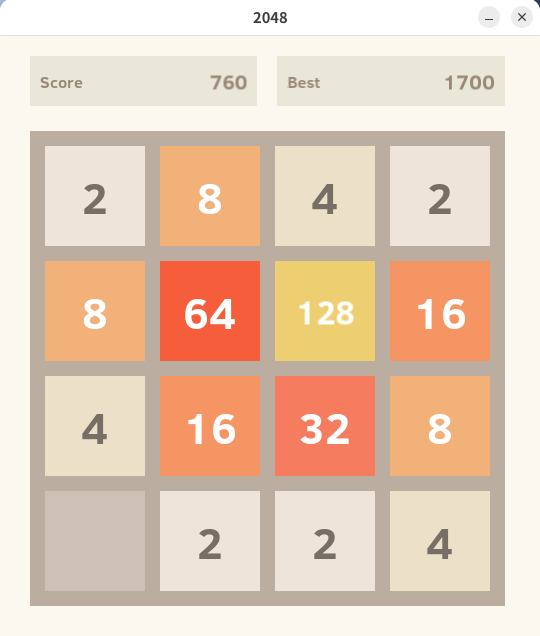

# 2048 C++ Clone

This is a C++ clone of the popular game [2048](https://play2048.co/), created
by [Gabriele Cirulli](https://github.com/gabrielecirulli).
The game is built using the SDL3 and SDL3_ttf libraries.

## About

This is the first serious project I've taken on in C++.
I wanted to challenge myself by building a simple game while exploring low-level development and C++ tools.



## Requirements

- C++20 or later
- SDL3
- SDL3_ttf
- CMake

## Installation

Clone the repository and navigate to the project directory:

```bash
git clone https://github.com/saiteki-kai/2048.git

cd 2048/
```

Create a build directory and run CMake:

```bash
mkdir build
cd build/
cmake ..
```

Compile the project:

```bash
make
```

Run the game:

```bash
./2048
```

## Next Steps

- [x] Style / layout refactoring
- [x] Game states for game over, win, start showing keyboard instruction
- [x] Move hardcoded variables to layouts
- [x] Adaptable font size
- [x] Improve UI
- [ ] Refactor Game::MoveCol and Game::MoveRow
- [ ] Handle inputs correctly (fix mouse freeze while playing)
- [ ] Game tests
- [ ] Improve memory usage (reallocations, rendering cache)
- [ ] Rounded borders
- [ ] Animations